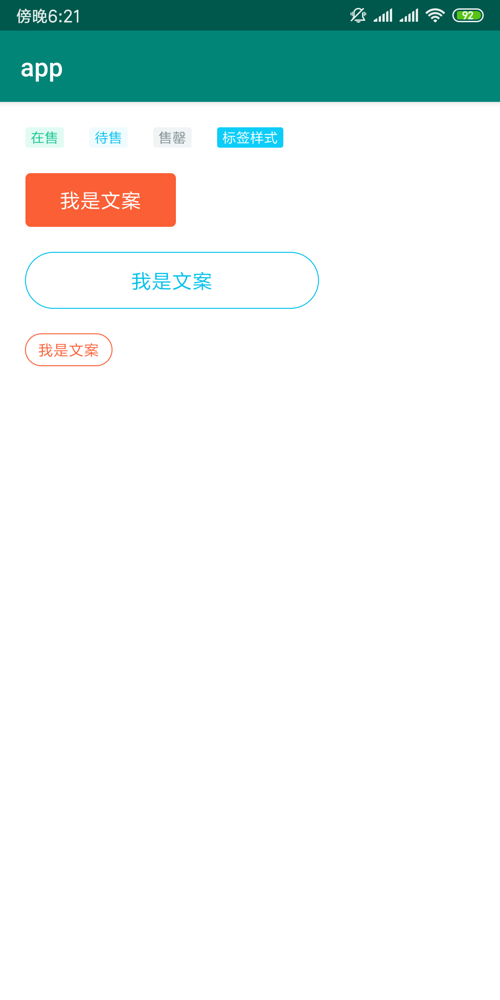

- 抽取和封装了一些设计稿上的通用控件

# RectStateView
## 应用场景


## 实现效果


## 使用方式

RectStateView 的自定义属性

|自定义属性 | 释义 | 单位 | 是否必须指定 |
|---------|------| ----- | -------|
| rectBackgroundRadius | 矩形背景圆角角度 | dp | ✅ |
| leftIconSize | 文字左侧 icon 大小 | dp | ❌ |
| rectColorUnchecked | 矩形背景颜色 (未选中) | color | ✅ |
| rectColorChecked | 矩形背景颜色 (选中) | color | ❌ |
| leftIconUnchecked | 文本左侧小 icon (未选中) | drawable | ❌ |
| leftIconChecked |  文本左侧小 icon (选中) | drawable | ❌ |
| textColorUnchecked | 文本颜色 (未选中)| color |  ✅ |
|textColorChecked|文本颜色 (选中)|color| ❌|
| textUnchecked | 文本内容 (未选中) | string |  ✅|
| textChecked | 文本内容 (选中) | string | ❌|
| textSize | 文本大小 | dp | ✅ | 
| isSelected | 默认的选中状态 | boolean | ❌|

- 高亮色为未选中状态，默认也是这个状态。灰色为选中后的状态
- 如果只需要使用未选中状态，checked 的选中状态非必须指定

### 示例

XML 

``` XML

    <com.custom.view.julivetextview.rectstateview.RectStateView
        android:id="@+id/rsv"
        android:layout_width="335dp"
        android:layout_height="44dp"
        android:layout_margin="15dp"
        app:layout_constraintLeft_toLeftOf="parent"
        app:layout_constraintTop_toBottomOf="@id/ct7"
        app:leftIconChecked="@mipmap/house_dynamic_icon_check"
        app:leftIconSize="16dp"
        app:leftIconUnchecked="@mipmap/house_dynamic_icon"
        app:rectBackgroundRadius="4dp"
        app:rectColorChecked="#F5F5F5"
        app:rectColorUnchecked="#EEF9FB"
        app:textChecked="取消动态变动通知"
        app:textColorChecked="#C4CBCC"
        app:textColorUnchecked="#00C0EB"
        app:textSize="14sp"
        app:textUnchecked="动态变动通知我" />


```

java

``` Java

    @Override
    protected void onCreate(@Nullable Bundle savedInstanceState) {
        super.onCreate(savedInstanceState);
        setContentView(R.layout.activity_ju_live_text_view);
        RectStateView rectStateView = findViewById(R.id.rsv);
        rectStateView.setOnClickListener(new View.OnClickListener() {
            @Override
            public void onClick(View v) {
                boolean isSelected = v.isSelected();
                if (isSelected) {
                    //Do something ...
                } else {
                    //Do something ...
                }
                v.setSelected(!isSelected);
            }
        });

    }

```


# RectTextView & CircularTextView

## 效果



## 使用

``` XML

<?xml version="1.0" encoding="utf-8"?>
<android.support.constraint.ConstraintLayout xmlns:android="http://schemas.android.com/apk/res/android"
    xmlns:app="http://schemas.android.com/apk/res-auto"
    android:layout_width="match_parent"
    android:layout_height="match_parent"
    android:background="#FFF">

    <com.custom.view.julivetextview.RectTextView
        android:id="@+id/rt1"
        android:layout_width="30dp"
        android:layout_height="16dp"
        android:layout_margin="20dp"
        android:text="在售"
        android:textColor="#12C48E"
        android:textSize="11sp"
        app:layout_constraintLeft_toLeftOf="parent"
        app:layout_constraintTop_toTopOf="parent"
        app:rectColor="#E1FBF3"
        app:rectRadius="2dp" />

    <com.custom.view.julivetextview.RectTextView
        android:id="@+id/rt2"
        android:layout_width="30dp"
        android:layout_height="16dp"
        android:layout_margin="20dp"
        android:text="待售"
        android:textColor="#00C0EB"
        android:textSize="11sp"
        app:layout_constraintLeft_toRightOf="@id/rt1"
        app:layout_constraintTop_toTopOf="parent"
        app:rectColor="#EFFBFE"
        app:rectRadius="2dp" />

    <com.custom.view.julivetextview.RectTextView
        android:id="@+id/rt3"
        android:layout_width="30dp"
        android:layout_height="16dp"
        android:layout_margin="20dp"
        android:text="售罄"
        android:textColor="#7E8C8F"
        android:textSize="11sp"
        app:layout_constraintLeft_toRightOf="@id/rt2"
        app:layout_constraintTop_toTopOf="parent"
        app:rectColor="#F0F4F5"
        app:rectRadius="2dp" />


    <com.custom.view.julivetextview.RectTextView
        android:id="@+id/rt4"
        android:layout_width="52dp"
        android:layout_height="16dp"
        android:layout_margin="20dp"
        android:text="标签样式"
        android:textColor="#FFF"
        android:textSize="11sp"
        app:layout_constraintLeft_toRightOf="@id/rt3"
        app:layout_constraintTop_toTopOf="parent"
        app:rectColor="#0DCDF8"
        app:rectRadius="2dp" />


    <com.custom.view.julivetextview.RectTextView
        android:id="@+id/rt5"
        android:layout_width="118dp"
        android:layout_height="42dp"
        android:layout_margin="20dp"
        android:text="我是文案"
        android:textColor="#FFF"
        android:textSize="16sp"
        app:layout_constraintLeft_toLeftOf="parent"
        app:layout_constraintTop_toBottomOf="@id/rt1"
        app:rectColor="#FA5F35"
        app:rectRadius="4dp" />

    <com.custom.view.julivetextview.CircularTextView
        android:id="@+id/ct6"
        android:layout_width="230dp"
        android:layout_height="44dp"
        android:layout_margin="20dp"
        android:text="我是文案"
        android:textColor="#00C0EB"
        android:textSize="16sp"
        app:circularRadius="22dp"
        app:layout_constraintLeft_toLeftOf="parent"
        app:layout_constraintTop_toBottomOf="@id/rt5" />

    <com.custom.view.julivetextview.CircularTextView
        android:layout_width="68dp"
        android:layout_height="25dp"
        android:layout_margin="20dp"
        android:text="我是文案"
        android:textColor="#FA5F35"
        android:textSize="12sp"
        app:circularRadius="12.5dp"
        app:layout_constraintLeft_toLeftOf="parent"
        app:layout_constraintTop_toBottomOf="@id/ct6" />


</android.support.constraint.ConstraintLayout>


```


RectTextView 为实心圆角矩形, 需要指定 rectColor 矩形背景颜色 以及 圆角角度 rectRadius 自定义属性<br/>
CircularTextView 空心边框线, 需要指定 circularRadius 圆角角度自定义属性

RectTextView 和 CircularTextView 的点击事件和 TextView 一致

## 待补充说明的控件

- CountDownView 倒计时控件
- SubItemTextView 通用 sub item 的 title 控件, 例如  【 户型介绍(11)     全部户型 > 】
- SpecialPriceTextView 带文字横向居中划线的 TextView 用于标识原价被划除 , 使用时建议 left right 加 2dp padding


